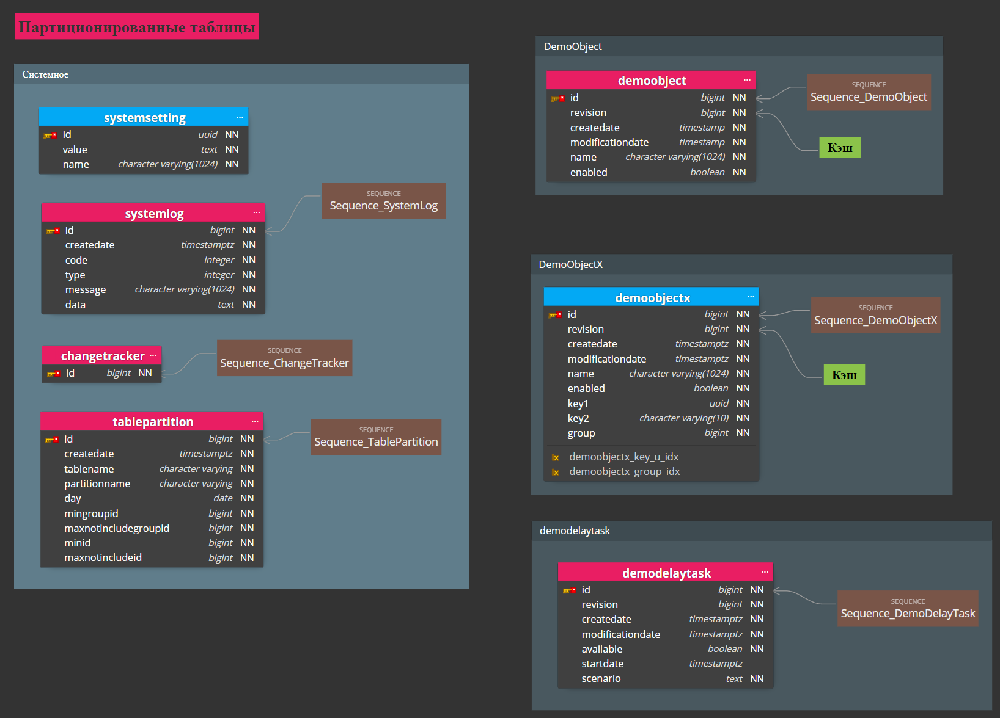

Полнофункциональный демонстрационный сервер на базе библиотеки [Wattle3](https://github.com/KlestovAlexej/Wattle3.Examples).

---

Примечания.
 

- Сервер написан 100% на [C#](https://ru.wikipedia.org/wiki/C_Sharp) под [.NET 7](https://devblogs.microsoft.com/dotnet/announcing-dotnet-7/).
- **Сборка и запуск тестов**
	- Проект [DemoServer.Processing.Application.csproj](src/DemoServer.Processing.Application/DemoServer.Processing.Application.csproj) при сборке использует [PowerShell](https://learn.microsoft.com/en-us/powershell/scripting/install/installing-powershell?view=powershell-7.3).
 Из командной строки должен быть доступен запуск [PWSH.exe](https://learn.microsoft.com/ru-ru/powershell/module/microsoft.powershell.core/about/about_pwsh?view=powershell-7.3)
	- Для запуска тестов в классе [ShtrihM.DemoServer.Testing.BaseDbTests](src/DemoServer.Testing/BaseDbTests.cs) надо определить параметры подключения к PostgreSQL.
- Все [автоматические тесты сервера](tests) оформлены как [NUnit](https://nunit.org/)-тесты для запуска в ОС Windows из-под [Visual Studio 2022](https://visualstudio.microsoft.com/ru/vs/) (версии не ниже 17.6.5).
- Все БД [PostgreSQL](https://www.postgresql.org/) (версии не ниже 15) [создаются](https://github.com/KlestovAlexej/Wattle3.DemoServer/blob/95348fd30ce41607e97bd4b727b0e72fa0861db7/src/DemoServer.Testing/BaseDbTests.cs#L55) и [уничтожаются](https://github.com/KlestovAlexej/Wattle3.DemoServer/blob/95348fd30ce41607e97bd4b727b0e72fa0861db7/src/DemoServer.Testing/BaseDbTests.cs#L70) автоматически при запуске тестов.
- [SQL-скрипт](src/DemoServer.Processing.DataAccess.Postgresql/DemoServer.Processing.sql) БД PostgreSQL создан из [модели](src/DemoServer.Processing.DataAccess.Postgresql/DemoServer.Processing.dmm) спроектированной с использованием [Luna Modeler](https://www.datensen.com/data-modeling/luna-modeler-for-relational-databases.html).
 
Модель БД PostgreSQL : 

---

## В демонстрации сервера показаны.

- [Реализован](src/DemoServer.Processing.Model/Implements/UnitOfWork.cs) паттерн [Unit of Work](https://martinfowler.com/eaaCatalog/unitOfWork.html)
- [Пример логирования](https://github.com/KlestovAlexej/Wattle3.DemoServer/blob/33de4b303ffb87c1ce43c089b191ebe04c301da4/src/DemoServer.Processing.Application/appsettings.json#L12) с использованием [serilog](https://serilog.net/)
	- К примеру, для просмотра логов в онлайне укажите [токен](https://github.com/KlestovAlexej/Wattle3.DemoServer/blob/76abbcacc47f599b4731c22b0acb9f201e2efc32/src/DemoServer.Processing.Application/appsettings.json#L36) сайта [logz.io](https://logz.io/) с бесплатным доступом.
- [Интеграция](https://github.com/KlestovAlexej/Wattle3.DemoServer/blob/8a280815be311432f3dd9e6281b8b36423a1ed61/src/DemoServer.Processing.Model/Implements/ControllersServices/ControllerServiceDispatchProxy.cs#L27) с [OpenTelemetry](https://opentelemetry.io/)
	- К примеру, для просмотра телементрии в онлайне укажите [токен](https://github.com/KlestovAlexej/Wattle3.DemoServer/blob/59b7edeb70966acca443b4a8c4afc3fb133d688e/src/DemoServer.Processing.Application/Program.cs#L89) сайта [lightstep.com](https://app.lightstep.com/signin?redirect=%2F) с бесплатным доступом.
- Реализация [REST](https://learn.microsoft.com/ru-ru/aspnet/core/tutorials/first-web-api?view=aspnetcore-7.0&tabs=visual-studio) интерфейса
	- [Тесты](tests/DemoServer.Processing.Tests.Model/TestsDemoObjectControllerService.cs) службы [контроллера](src/DemoServer.Processing.Api/DemoObjectController.cs) REST интерфейса
	- [Swagger](https://learn.microsoft.com/ru-ru/aspnet/core/tutorials/getting-started-with-swashbuckle?view=aspnetcore-7.0&tabs=visual-studio) описание REST интерфейса
	- Созданы [валидаторы DTO](src/DemoServer.Processing.Api/Validators/WebApplicationBuilderExtensions.cs) получаемых по REST интерфейсу
	- Реализация [высокоуровневого клиент](src/DemoServer.Processing.Api.Clients/ProcessingClient.cs) REST интерфейса на базе [RestSharp](https://restsharp.dev/)
	- [Интеграционные тесты](tests/DemoServer.Processing.Tests.Application/TestsApiServer.cs) REST интерфейса
- Интеграция с [Entity Framework](https://learn.microsoft.com/ru-ru/ef/core/get-started/overview/first-app?tabs=netcore-cli) в рамках Unit of Work [c тестами](tests/DemoServer.Processing.Tests.Model/TestsUnitOfWork.cs)

- Создан доменный объект [DemoObject](src/DemoServer.Processing.Model/DomainObjects/DemoObject/DomainObjectDemoObject.cs) доступный по REST интерфейсу
	- Реализован [кэширующий маппер](https://github.com/KlestovAlexej/Wattle3.DemoServer/blob/061c419225f81fbdecfec4bce193b8e396812456/src/DemoServer.Processing.Common/WellknownDomainObjectFields.cs#L180) БД
	- Данные в БД хранится [в партиционированных таблицах](https://github.com/KlestovAlexej/Wattle3.DemoServer/blob/061c419225f81fbdecfec4bce193b8e396812456/src/DemoServer.Processing.Common/WellknownDomainObjectFields.cs#L181)
	- Партиции БД [создаются автоматически](src/DemoServer.Processing.Model/Implements/PartitionsSponsor.cs) для каждого календарного дня
	- Реализована [оптимистическая конкуренция при обновлении](https://github.com/KlestovAlexej/Wattle3.DemoServer/blob/061c419225f81fbdecfec4bce193b8e396812456/src/DemoServer.Processing.Common/WellknownDomainObjectFields.cs#L183) на уровне БД
	- Реализована [критическая секция](src/DemoServer.Processing.Model/Implements/UnitOfWorkLocks/UnitOfWorkLocksHubTyped.cs) при [обновлении DemoObject](https://github.com/KlestovAlexej/Wattle3.DemoServer/blob/061c419225f81fbdecfec4bce193b8e396812456/src/DemoServer.Processing.Model/DomainObjects/DemoObject/DomainObjectDemoObject.cs#L95)
	- При создании объекта показана [стратегия определения успешности коммита](https://github.com/KlestovAlexej/Wattle3.DemoServer/blob/061c419225f81fbdecfec4bce193b8e396812456/src/DemoServer.Processing.Model/DomainObjects/DemoObject/DomainObjectDemoObject.cs#L152) Unit of Work 

- Создан доменный объект [DemoObjectX](src/DemoServer.Processing.Model/DomainObjects/DemoObject/DomainObjectDemoObject.cs)
	- Реализован кэширующий маппер БД
	- Пример произвольной выборки доменных объектов с использованием [Entity Framework](https://github.com/KlestovAlexej/Wattle3.DemoServer/blob/d5bae07d895043e9c05035d84a41dba8a88b0177/tests/DemoServer.Processing.Tests.Model/TestsDomainObjectX.cs#L32)
	- Пример использования столбца таблицы БД с [именем в кавычках](https://github.com/KlestovAlexej/Wattle3.DemoServer/blob/92ca77457c4f495fde82e4202aeaf3bc03067d74/src/DemoServer.Processing.Common/WellknownDomainObjectFields.cs#L280)
	- Реализована [оптимистическая конкуренция при обновлении](https://github.com/KlestovAlexej/Wattle3.DemoServer/blob/104c0f9cf212fcc98e55640c8f2ea9034e2bbb04/src/DemoServer.Processing.Common/WellknownDomainObjectFields.cs#L180) на уровне БД
	- Реализована критическая секция при обновлении и [создании DemoObjectХ](https://github.com/KlestovAlexej/Wattle3.DemoServer/blob/92ca77457c4f495fde82e4202aeaf3bc03067d74/src/DemoServer.Processing.Model/DomainObjects/DemoObjectX/DomainObjectIntergratorDemoObjectX.cs#L44)
	- При создании объекта показана стратегия определения успешности коммита Unit of Work 
	- Показана реализация [реестра идентити объектов](src/DemoServer.Processing.Model/DomainObjects/DemoObjectX/DemoObjectXIdentitiesService.cs) - механизма полного кэшированияв в памяти (с фоновым прогревом) идентификаторов и альтернативных ключей доменных объектов для минимизации и даже полного исключения обращений к БД
	- Показано [удаление объектов](https://github.com/KlestovAlexej/Wattle3.DemoServer/blob/92ca77457c4f495fde82e4202aeaf3bc03067d74/src/DemoServer.Processing.Model/DomainObjects/DemoObjectX/DomainObjectDemoObjectX.cs#L141)
	- Реализован [составной альтернативный ключ](https://github.com/KlestovAlexej/Wattle3.DemoServer/blob/92ca77457c4f495fde82e4202aeaf3bc03067d74/src/DemoServer.Processing.Common/WellknownDomainObjectFields.cs#L224C1-L224C1) на уровне БД и на уровне кода
		- Реализовано создание объекта с [проверкой уникальности альтернативного ключа](https://github.com/KlestovAlexej/Wattle3.DemoServer/blob/92ca77457c4f495fde82e4202aeaf3bc03067d74/src/DemoServer.Processing.Model/DomainObjects/DemoObjectX/DomainObjectIntergratorDemoObjectX.cs#L52) на уровне кода (с минимальным и даже без обращения к БД)
		- Создан интерфейс [поиска по альтернативному ключу](https://github.com/KlestovAlexej/Wattle3.DemoServer/blob/92ca77457c4f495fde82e4202aeaf3bc03067d74/src/DemoServer.Processing.Model/DomainObjects/DemoObjectX/DomainObjectRegisterDemoObjectX.cs#L15) (с минимальным и даже без обращения к БД)
	- Реализовано понятие [группы объектов объединенных константным признаком](https://github.com/KlestovAlexej/Wattle3.DemoServer/blob/92ca77457c4f495fde82e4202aeaf3bc03067d74/src/DemoServer.Processing.Common/WellknownDomainObjectFields.cs#L225)
		- Создан интерфейс [поиска коллекции объектов по значению группы](https://github.com/KlestovAlexej/Wattle3.DemoServer/blob/92ca77457c4f495fde82e4202aeaf3bc03067d74/src/DemoServer.Processing.Model/DomainObjects/DemoObjectX/DomainObjectRegisterDemoObjectX.cs#L15) (с минимальным и даже без обращениея к БД)
